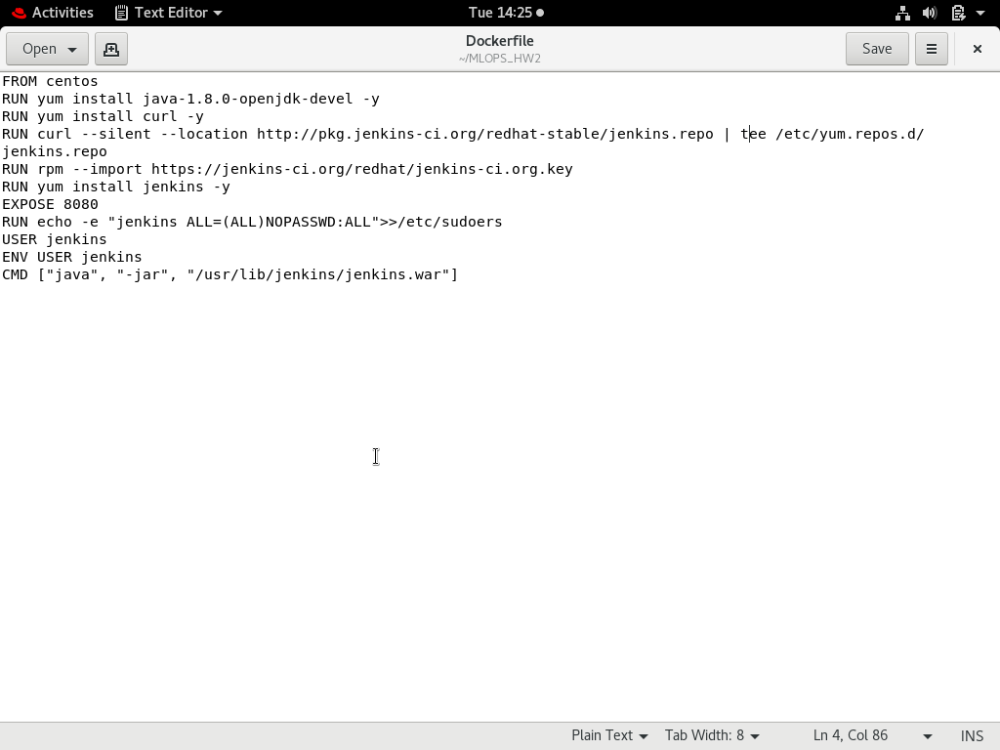
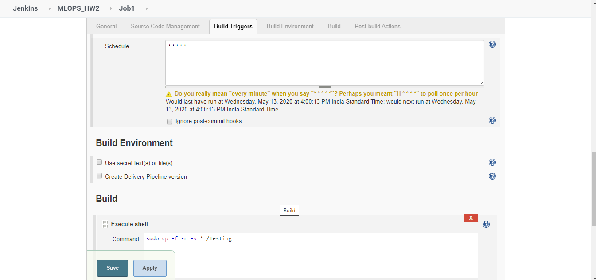
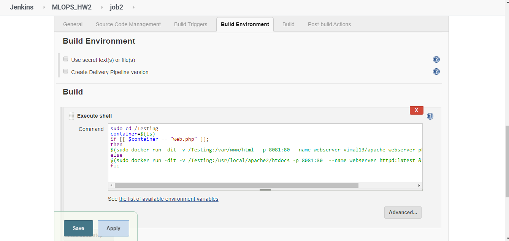
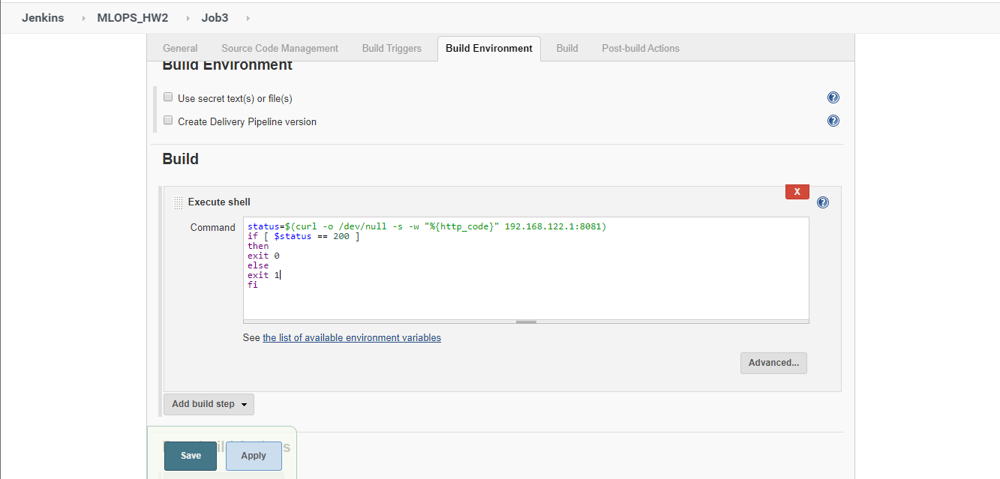
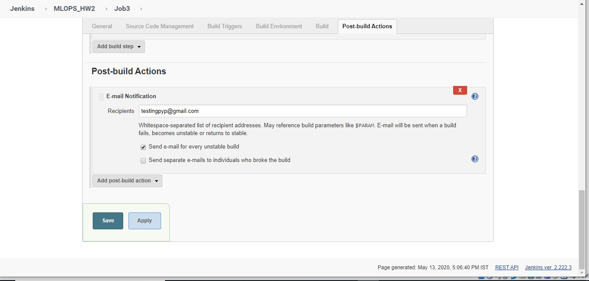
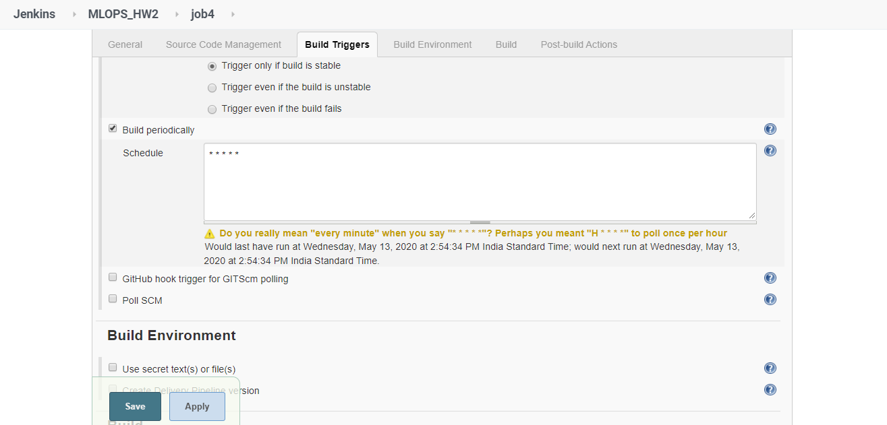
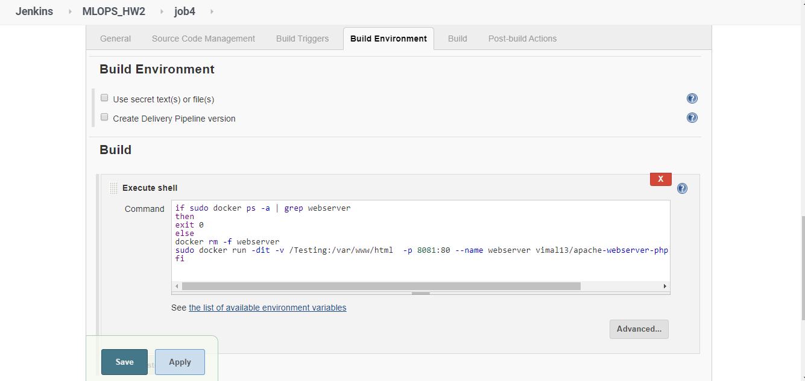
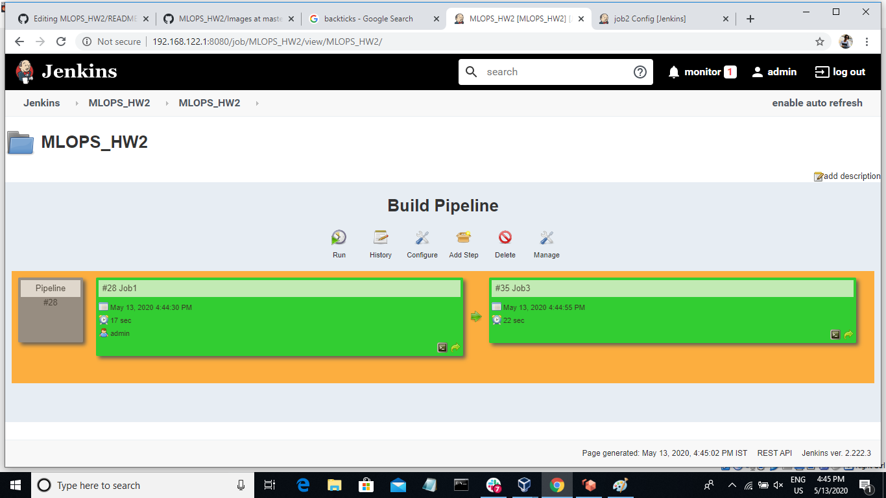

# MLOPS_HW2_Automatic_WebServer_Deployment_with_Docker_Jenkins_Github_Integration
The Project is to automatically deploy a web server once the developer commits the code then the jenkins job will automatically test the code and if it is success then the page will be deployed in a webserver if not error message will be sent to developer via email also if any server fails then a job will automatically deploy another webserver
## Installation of jenkins using a Dockerfile
The first thing is to open the redhat linux then disable firewall and start the docker.                                                 
Its always a good practise to create a workspace directory seperately for working so create using  ```mkdir workspace``` and get inside the folder. Now create a Dockerfile and note that the dockerfile should always be in the name Dockerfile with no extension. Below i have configured the dockerfile with centos .



After that using the command ```docker build -t jenkins:v1 . ``` build the dockerfile


Now run the command ```docker run -it --privileged -p 8082:80 -v --name jenkinsinit jenkins:v1 ```                                     
It is recommended to give --privileged to give authority to the container and to prevent future problems


The password of jenkins can be found in the location ```/var/lib/jenkins/secrets/initialAdminpassword```                              
Now your jenkins is ready. Lets Create jobs.

## Job1 - Pulling the Github Repository once commit is made
We can do this using the jenkins job and creating hooks using post-commit.sample file for this part refer to my previous project for more details. First job is configured as follows.



## job2- By looking at the file pushed by developer job2 will automatically create a web server
Also the job2 will be started as soon as job1 is completed as job1 is set as upstream project of job2



## job3- This will test the server and if server works properly then the code will exit if server is not working then the build will fail and will send the details to our mail id.
job3 will be executed once job2 is successfully build as job3 is set as downstream project of job2





## job4-This build will check periodically if the container is working or not if not then it will deploy a new container automatically





## Build Pipeline - It is a interactive way of using and managing jenkins and jobs. It is a powerful feature in which a large builds can be managed easily
To use this install the Build Pipeline Plugin and create a view.


